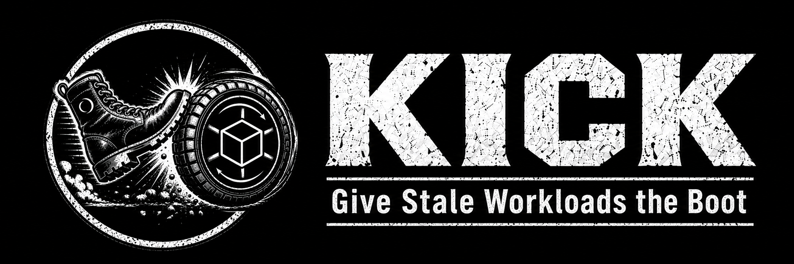

<p align="center">
  
</p>

# KICK operator

KICK restarts your workloads when the config they depend on changes.

When a Secret or ConfigMap that a workload consumes (via `env`, `envFrom`, or a mounted volume) changes after the workload's last rollout, KICK triggers a rolling restart using the standard `kubectl.kubernetes.io/restartedAt` annotation. It never uses privileged host access. By default it restarts on its own; you can enable optional GitOps gating with Argo CD, Flux, or Kargo.

Supported workloads: `Deployment`, `StatefulSet`, `DaemonSet`, and `argoproj.io/Rollout` (opt-in).


> The diagrams are editable draw.io files under [docs/static/images/](docs/static/images/) — open any `*.drawio.svg` in [diagrams.net](https://app.diagrams.net) to change it. See [the concepts docs](https://corewire.github.io/kick/docs/concepts/) for the full picture.

## Try it

**1. A Deployment that reads a Secret**

```yaml
apiVersion: v1
kind: Secret
metadata:
  name: web-secret
  namespace: shop
type: Opaque
stringData:
  API_TOKEN: alpha
---
apiVersion: apps/v1
kind: Deployment
metadata:
  name: web
  namespace: shop
  labels: { app: web }
spec:
  replicas: 1
  selector:
    matchLabels: { app: web }
  template:
    metadata:
      labels: { app: web }
    spec:
      containers:
      - name: app
        image: nginx
        envFrom:
        - secretRef:
            name: web-secret      # the dependency KICK will watch
```

**2. A KickPolicy that watches it**

```yaml
apiVersion: kick.corewire.io/v1alpha1
kind: KickPolicy
metadata:
  name: web
  namespace: shop
spec:
  discovery:
    workloadSelector:
      matchLabels:
        app: web                  # watch the Deployment labelled app=web
```

No GitOps tool, no annotations — that's the whole setup. KICK auto-discovers the
Secrets and ConfigMaps each matched workload uses.

**3. Change the Secret**

```bash
kubectl -n shop patch secret web-secret --type merge \
  -p '{"stringData":{"API_TOKEN":"bravo"}}'
```

**4. Watch KICK restart the Deployment**

```bash
kubectl -n shop get kickrequests            # a KickRequest appears for web
kubectl -n shop rollout status deploy/web   # a fresh rollout starts
```

A dependency changed, so KICK rolled the Deployment. That's it.

## Go further

**Watch everything automatically.** Drop the selector and KICK watches every
`Deployment`, `StatefulSet`, and `DaemonSet` in scope, auto-discovering each
one's Secrets and ConfigMaps:

```yaml
spec:
  discovery:
    workloadSelector: {}          # explicit empty selector = watch every workload
```

**Restart only on specific config changes.** Add a `dependencySelector` and a
workload restarts only when a Secret/ConfigMap it consumes *and* matches the
selector changes — other config changes are ignored:

```yaml
spec:
  discovery:
    dependencySelector:
      matchLabels:
        kick-scope: watched       # only these Secrets/ConfigMaps trigger restarts
```

**Respect your Argo CD sync windows.** Already on Argo CD? Point KICK at it and
restarts only happen when the Application is in sync and a sync window is open:

```yaml
spec:
  discovery:
    workloadSelector:
      matchLabels:
        app: web
  gitOps:
    provider: Auto                # detect Argo CD (or Flux) ownership + windows
```

**Want a maintenance window without GitOps?** Add KICK-native windows — see
[KickPolicy reference](https://corewire.github.io/kick/docs/reference/kickpolicy/).

## Learn more

- [GitHub Pages docs home](https://corewire.github.io/kick/docs/)
- [How KICK works](https://corewire.github.io/kick/docs/concepts/)
- [KickPolicy reference](https://corewire.github.io/kick/docs/reference/kickpolicy/)
- [Dependency discovery](https://corewire.github.io/kick/docs/concepts/dependency-discovery/) · [Freshness](https://corewire.github.io/kick/docs/concepts/freshness/) · [GitOps gates](https://corewire.github.io/kick/docs/concepts/gitops-gates/)

> **Status:** bootstrap baseline — stable, provider-neutral foundations (API, dependency extraction, controller/Argo CD boundaries, traceability). Some Kubernetes-timestamp and Argo CD ownership/window details remain explicit research tasks; do not replace them with assumptions.


## Specs and references

- authoritative specifications: `ai-docs/kick-operator-specs/kick-specs/`

## First checks

```bash
make fmt
make test
make feature-coverage
```

## Local dev with Tilt (kind-kick-dev only)

```bash
make kind-create
make tilt-up
```

Rules enforced by this repository:

- cluster context is `kind-kick-dev`;
- kubeconfig path is `.kubeconfig-kind-kick-dev` in repo root;
- commands always pass explicit `--kubeconfig` and `--context`.

Additional helpers:

```bash
make kind-load
make install
make test-e2e
make uninstall
make tilt-down
```

Timeline and tracing:

```text
--timeline-bind-address=:8090
--otel-otlp-endpoint=<collector-host:4317>
--otel-otlp-insecure=true
```

Timeline UI path: `/timeline/ui` — opens a compact cross-namespace overview (state-over-time swimlanes, color-coded event log, and a drag-to-zoom time ruler with a from/to picker).

> **⚠ Experimental:** the timeline UI/API is unauthenticated and read-only. Use it only via localhost or `kubectl port-forward`; never expose it through an Ingress or untrusted network.

## Security note

The controller ServiceAccount requires read access to Secrets and ConfigMaps in managed namespaces to evaluate dependency freshness. Treat this ServiceAccount as sensitive and scope RBAC and namespace access accordingly.

Dependencies are pinned and should be reviewed before each production release.
