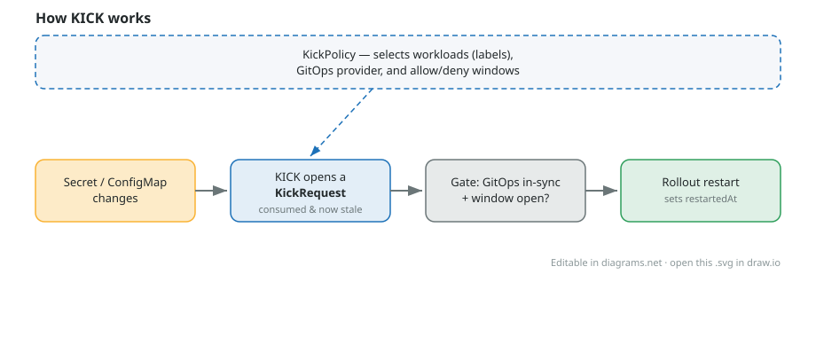

# KICK operator

KICK restarts your workloads when the config they depend on changes — but only when it is safe to do so.

When a Secret or ConfigMap that a workload consumes (via `env`, `envFrom`, or a mounted volume) changes after the workload's last rollout, KICK asks your GitOps tool "are you in sync, and is a deploy window open?". If yes, it triggers a rolling restart using the standard `kubectl.kubernetes.io/restartedAt` annotation. It never uses privileged host access and never fights your GitOps controller.

Supported workloads: `Deployment`, `StatefulSet`, `DaemonSet`.



> The diagram is an editable draw.io file — open [docs/concept.drawio.svg](docs/concept.drawio.svg) in [diagrams.net](https://app.diagrams.net) to change it.

## Example

Tell KICK which workloads to watch with a `KickPolicy`:

```yaml
apiVersion: kick.corewire.io/v1alpha1
kind: KickPolicy
metadata:
  name: web
  namespace: shop
spec:
  discovery:
    mode: Auto
    workloadSelector:
      matchLabels:
        app: web          # watch every workload with this label
  gitOps:
    provider: Auto        # auto-detect Argo CD or Flux ownership
  minInterval: 30s
```

A matching workload just consumes config normally — no annotations required:

```yaml
apiVersion: apps/v1
kind: Deployment
metadata:
  name: web
  namespace: shop
  labels: { app: web }
spec:
  template:
    spec:
      containers:
      - name: app
        image: nginx
        envFrom:
        - secretRef:
            name: web-secret   # change this Secret's data -> KICK restarts web
```

Change `web-secret`'s data and, once your GitOps owner is in sync and any deploy window is open, KICK restarts `web`. Inspect the decision:

```bash
kubectl -n shop get kickrequests
```

Prefer KICK-native windows over a GitOps provider? Add them to the policy (an overlapping `Deny` always beats `Allow`):

```yaml
  gitOps:
    provider: Auto
    schedule:
      windows:
      - kind: Allow
        schedule: "0 2 * * *"   # 02:00 every day
        duration: 1h
      - kind: Deny
        schedule: "0 2 * * 6"   # ...except Saturday 02:00
        duration: 1h
```

> **Status:** bootstrap baseline — stable, provider-neutral foundations (API, dependency extraction, controller/Argo CD boundaries, traceability). Some Kubernetes-timestamp and Argo CD ownership/window details remain explicit research tasks; do not replace them with assumptions.


## Specs and references

- authoritative specifications: `ai-docs/kick-operator-specs/kick-specs/`
- copied starter reference: `ai-docs/kick-operator-starter/`

## First checks

```bash
make fmt
make test
make feature-coverage
```

## Local dev with Tilt (kind-kick-dev only)

```bash
make kind-create
make tilt-up
```

Rules enforced by this repository:

- cluster context is `kind-kick-dev`;
- kubeconfig path is `.kubeconfig-kind-kick-dev` in repo root;
- commands always pass explicit `--kubeconfig` and `--context`.

Additional helpers:

```bash
make kind-load
make install
make test-e2e
make uninstall
make tilt-down
```

Timeline and tracing:

```text
--timeline-bind-address=:8090
--otel-otlp-endpoint=<collector-host:4317>
--otel-otlp-insecure=true
```

Timeline UI path: `/timeline/ui` — opens a compact cross-namespace overview (state-over-time swimlanes, color-coded event log, and a drag-to-zoom time ruler with a from/to picker).

> **⚠ Experimental:** the timeline UI/API is unauthenticated and read-only. Use it only via localhost or `kubectl port-forward`; never expose it through an Ingress or untrusted network.

## Security note

The controller ServiceAccount requires read access to Secrets and ConfigMaps in managed namespaces to evaluate dependency freshness. Treat this ServiceAccount as sensitive and scope RBAC and namespace access accordingly.

Dependencies are pinned as starter values and must be reviewed before the first production implementation pull request.
