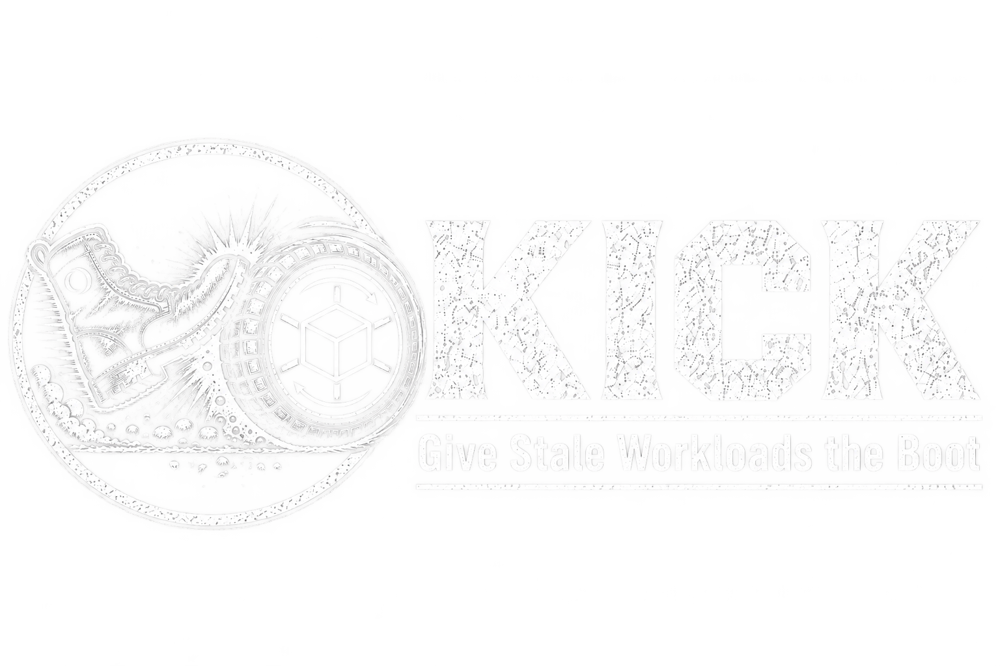
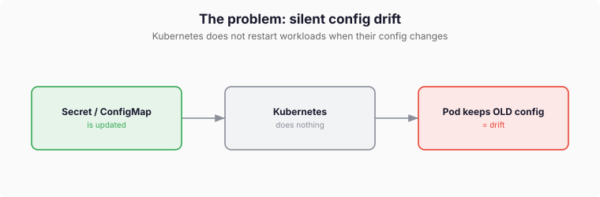

<p align="center">
  <picture>
    <source media="(prefers-color-scheme: dark)" srcset="docs/static/images/kick-long-dark.png">
    
  </picture>
</p>

<p align="center">
  Kubernetes operator that restarts workloads when the Secrets and ConfigMaps they consume change.
</p>

<p align="center">
  <a href="https://corewire.github.io/kick/docs/">Documentation</a> ·
  <a href="https://corewire.github.io/kick/docs/quickstart/">Quickstart</a> ·
  <a href="https://corewire.github.io/kick/docs/installation/">Installation</a> ·
  <a href="https://corewire.github.io/kick/docs/reference/kickpolicy/">API reference</a>
</p>

---

Kubernetes never restarts a Pod when a `Secret` or `ConfigMap` it uses changes.
Environment variables are read once at Pod start, and mounted files only take
effect if the process re-reads them. The Pod keeps serving the old config.



KICK watches the config a workload actually consumes and restarts it with the
standard `kubectl.kubernetes.io/restartedAt` annotation when that config changed
after the last rollout. The restart can be gated on your GitOps tool.


## Features

| Feature | What it does | Docs |
|---|---|---|
| Automatic dependency discovery | Finds the Secrets and ConfigMaps a workload uses via `env`, `envFrom`, and mounted or projected volumes. No annotations, no injected hashes. | [Dependency discovery](https://corewire.github.io/kick/docs/concepts/dependency-discovery/) |
| Content-based change detection | Only real content changes count. `imagePullSecrets` never trigger a restart. | [Dependency discovery](https://corewire.github.io/kick/docs/concepts/dependency-discovery/) |
| Freshness comparison | Compares the latest relevant change against the workload's current rollout, so an already-restarted workload is left alone. | [Freshness](https://corewire.github.io/kick/docs/concepts/freshness/) |
| Workload support | `Deployment`, `StatefulSet`, `DaemonSet`, and `argoproj.io/Rollout` (opt-in, restarted via `spec.restartAt`). | [Argo Rollouts](https://corewire.github.io/kick/docs/guides/argo-rollouts/) |
| Works without GitOps | Default mode. No Argo CD, Flux, or Kargo required. | [Without GitOps](https://corewire.github.io/kick/docs/guides/without-gitops/) |
| GitOps gating | Restarts only when ownership is unambiguous and the sync window is open. Providers: Argo CD, Flux, Kargo, or `Auto` detection. | [GitOps gates](https://corewire.github.io/kick/docs/concepts/gitops-gates/) |
| Native restart windows | Time windows and a `minInterval` per workload on the policy itself, independent of any GitOps tool. | [KickPolicy reference](https://corewire.github.io/kick/docs/reference/kickpolicy/) |
| Dependency selector | Narrows which Secrets and ConfigMaps may trigger a restart. | [KickPolicy reference](https://corewire.github.io/kick/docs/reference/kickpolicy/) |
| Dry run | Evaluates policies and reports what would happen, without restarting anything. | [KickPolicy reference](https://corewire.github.io/kick/docs/reference/kickpolicy/) |
| Secrets Store CSI | Detects rotation of CSI-mounted secrets. | [External secrets](https://corewire.github.io/kick/docs/guides/external-secrets/) |
| Durable state | Every decision lives in a `KickRequest`, so a controller restart loses nothing. | [KickRequest reference](https://corewire.github.io/kick/docs/reference/kickrequest/) |
| Notifications | Webhook delivery for restart events via `NotificationPolicy`. | [NotificationPolicy reference](https://corewire.github.io/kick/docs/reference/notificationpolicy/) |
| Observability | Events, metrics, and OpenTelemetry traces. Secret data and content digests are never logged. | [Metrics](https://corewire.github.io/kick/docs/reference/metrics/) · [Events](https://corewire.github.io/kick/docs/reference/events/) |
| Timeline UI | Read-only cross-namespace view of what KICK did and when. Experimental, unauthenticated, localhost only. | [Timeline UI](https://corewire.github.io/kick/docs/development/timeline-ui/) |

## Install

```bash
helm install kick oci://ghcr.io/corewire/charts/kick \
  --namespace kick-system --create-namespace
```

Chart values and CRD upgrade handling: [Installation](https://corewire.github.io/kick/docs/installation/).

## Use

A `KickPolicy` selects workloads. Everything else is discovered:

```yaml
apiVersion: kick.corewire.io/v1alpha1
kind: KickPolicy
metadata:
  name: web
  namespace: shop
spec:
  discovery:
    workloadSelector:
      matchLabels:
        app: web      # {} watches every workload in scope
```

Change a Secret that a matched workload consumes, and KICK opens a `KickRequest`
and rolls the workload:

```bash
kubectl -n shop patch secret web-secret --type merge \
  -p '{"stringData":{"API_TOKEN":"bravo"}}'
kubectl -n shop get kickrequests
kubectl -n shop rollout status deploy/web
```

Full walkthrough: [Quickstart](https://corewire.github.io/kick/docs/quickstart/).

To gate restarts on GitOps ownership and sync windows instead of running them
immediately:

```yaml
spec:
  gitOps:
    provider: Auto
```

## Development

```bash
make kind-create   # kind cluster kick-dev
make tilt-up       # controller and docs with live reload
make verify        # fmt, vet, lint, unit + envtest, feature coverage
make test-e2e      # Chainsaw suite
```

The cluster context is `kind-kick-dev` and the kubeconfig is
`.kubeconfig-kind-kick-dev`; commands pass both explicitly. See
[Development](https://corewire.github.io/kick/docs/development/).

## Security

The controller reads Secrets and ConfigMaps in the namespaces it manages. Treat
its ServiceAccount as sensitive and scope RBAC accordingly:
[Security](https://corewire.github.io/kick/docs/operations/security/),
[RBAC](https://corewire.github.io/kick/docs/operations/rbac/).

Diagrams are editable draw.io SVGs in [docs/static/images/](docs/static/images/).
