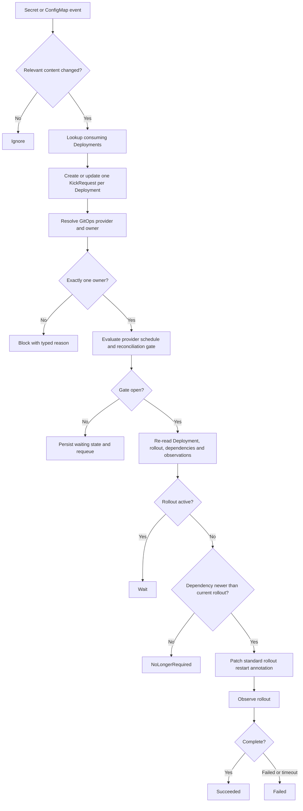

# Full KICK flow and cases

## Important cases

### Argo CD OutOfSync

Wait until the Application is Synced. Then recompute freshness. An Argo CD-created ReplicaSet may remove the need for KICK.

### Window closed

Persist the request and re-evaluate when the window may open or when the AppProject changes.

### Several dependency changes

Coalesce into one active request. Re-read the complete dependency set before action and perform at most one rollout.

### Dependency removed

The removed source no longer participates. If no current dependency is newer, mark `NoLongerRequired`.

### Existing rollout

Wait for completion. Compare dependency changes against the resulting current ReplicaSet.

### Controller restart

Recover every non-terminal KickRequest. Timers and previous in-memory queue state are not authoritative.
