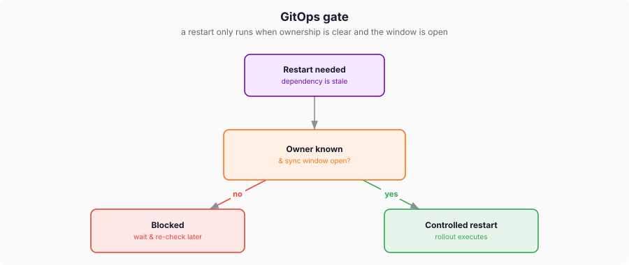

# GitOps Gates

KICK gates restart execution on provider ownership and provider state.

The gate is **opt-in**: with no `gitOps` provider (the default, `provider: None`)
KICK restarts as soon as a dependency is stale. Set `gitOps.provider` to defer
the decision to a GitOps tool.

Current provider focus: Argo CD.

Owner resolution:

- primary: tracking annotation;
- fallback: indexed Applications;
- zero or ambiguous owners block automatic restart.

Gate checks:

- AppProject sync windows;
- Application `Synced` status when reconciliation is required.

Waiting behavior:

- KICK persists waiting phase on `KickRequest`;
- KICK re-evaluates on timer and relevant provider object changes.