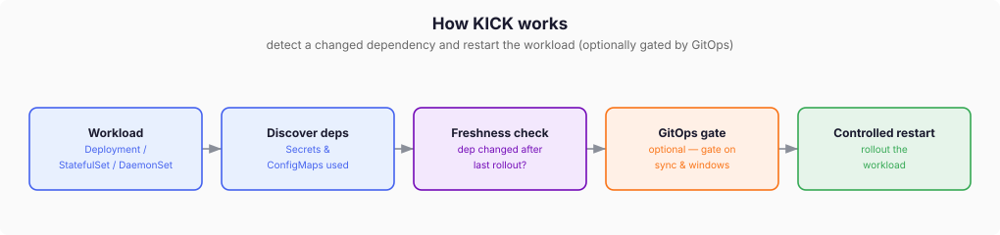

# How KICK works

A quick, visual overview of what KICK does and why.

## The problem

Kubernetes does **not** restart your workloads when a `Secret` or `ConfigMap`
they consume changes. Environment variables are read once at Pod start, and
mounted files update on disk but the process rarely reloads them. The result is
silent configuration drift: the running Pod keeps its old config.

## The solution

KICK watches the `Secret` and `ConfigMap` dependencies of a workload. When one
changes **after** the workload's last rollout, KICK triggers a controlled
restart. By default it restarts on its own; if you configure a GitOps provider
or native windows, it only restarts when those allow it.

| Step | What happens |
|------|--------------|
| Discover deps | Find the `Secret`s and `ConfigMap`s the workload uses via env and volumes. `imagePullSecrets` are excluded. |
| Freshness check | Compare the latest dependency change against the current rollout start time. Newer dependency = stale = restart needed. |
| GitOps gate *(optional)* | If a provider or windows are configured, confirm the owner is in sync and the window is open. Skipped when none are set. |
| Controlled restart | Re-read live state, then roll out the workload. |

## The GitOps gate (optional)

By default KICK restarts as soon as a dependency is stale. Add a GitOps provider
or native windows and a restart only runs when the owner is in sync and the
window is open; otherwise KICK waits and re-checks.

## Learn more

- [Hidden Restart Requirement](hidden-restart-requirement.md)
- [Dependency Discovery](dependency-discovery.md)
- [Freshness](freshness.md)
- [GitOps Gates](gitops-gates.md)

---

The diagrams are editable draw.io SVGs (`docs/images/*.drawio.svg`). Open them
in [draw.io](https://app.diagrams.net) to change them, then save in place.
