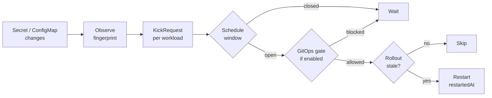

  
  


  Restart workloads when their Secrets &amp; ConfigMaps change &mdash; without breaking your Argo CD sync windows.


Kubernetes never restarts a Pod when a <code>Secret</code> or <code>ConfigMap</code> it
consumes changes. Environment variables are read once, at Pod start. Mounted
files do update on the node, but only take effect if the process re-reads them.
The Pod keeps serving its old config &mdash; no error, no signal.

Under GitOps this hurts twice. Argo CD happily syncs the new <code>Secret</code>,
reports <code>Synced</code>, and moves on &mdash; the workload stays stale while the
dashboard is green. So somebody runs <code>kubectl rollout restart</code>, by hand or
from a pipeline. That restart is an undeclared change, and it ignores the
freeze windows on your <code>AppProject</code>, because sync windows only ever
constrained Argo CD's own syncs.

KICK closes the gap from inside the GitOps model. It detects the change,
confirms the running rollout is older than it, and reads <code>spec.syncWindows</code>
straight off the owning <code>AppProject</code> &mdash; no sidecar, no plugin, no window
definitions copied into a second place. A restart KICK triggers is subject to
the same freeze as a sync. All it writes is the standard
<code>kubectl.kubernetes.io/restartedAt</code> annotation: no hashes, no environment
variables, no KICK-owned fields on your workloads.

















<h2 class="kick-home-heading">When the restart happens</h2>

<dl class="kick-modes">
  <dt>Inside your Argo CD sync windows</dt>
  <dd>Read from the owning <code>AppProject</code>. A closed window blocks the restart with <code>OutsideSchedule</code> and re-checks when it opens.</dd>
  <dt>Once Argo CD is settled</dt>
  <dd>Waits for the owning <code>Application</code> to finish its operation and report <code>Synced</code>.</dd>
  <dt>When Flux is done</dt>
  <dd>Waits for the owning <code>Kustomization</code> or <code>HelmRelease</code> to be <code>Ready</code> and not reconciling.</dd>
  <dt>Inside a window you define</dt>
  <dd>Cron <code>Allow</code> / <code>Deny</code> windows in the time zone you specify, for clusters with no GitOps tool.</dd>
  <dt>Right away</dt>
  <dd>The default. No GitOps tool, no schedule, no configuration.</dd>
</dl>

---

<h2 class="kick-home-heading">I want to...</h2>


  
  
  
  
  
  
  
  
  


<h2 class="kick-home-heading">Using an AI agent?</h2>

Point it at one URL instead of crawling the site.


  
  
  

